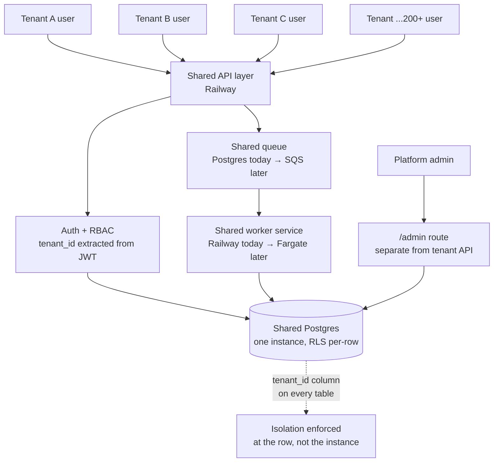
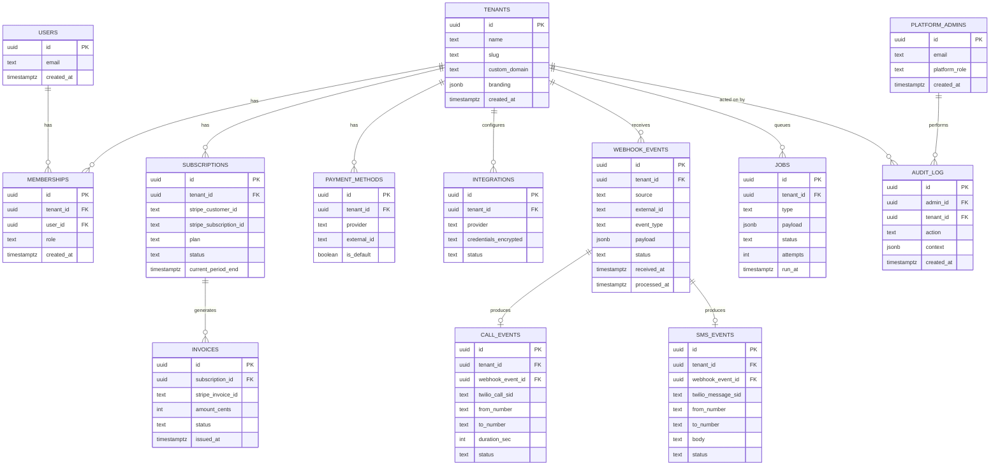
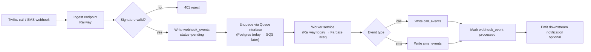
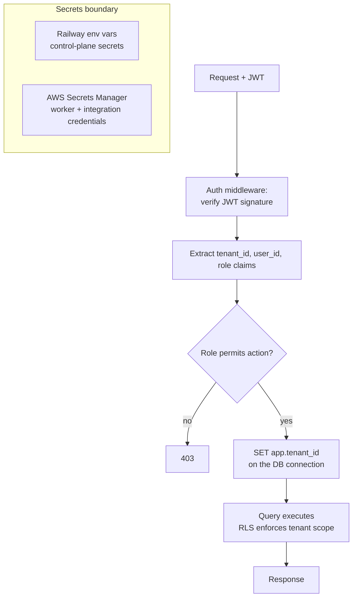
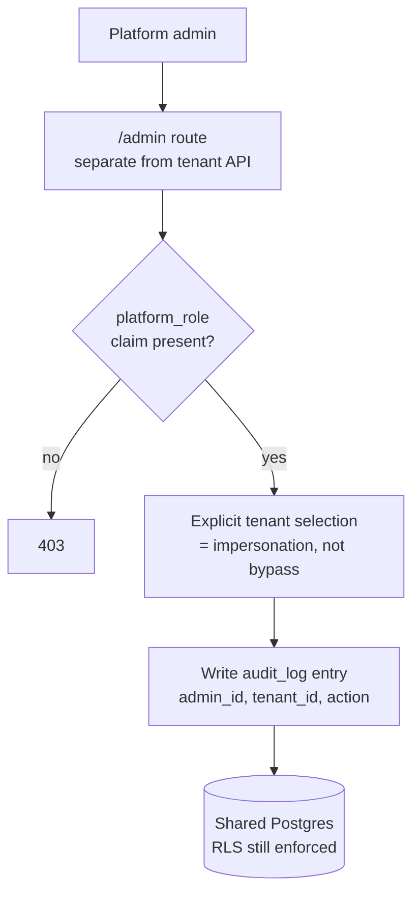
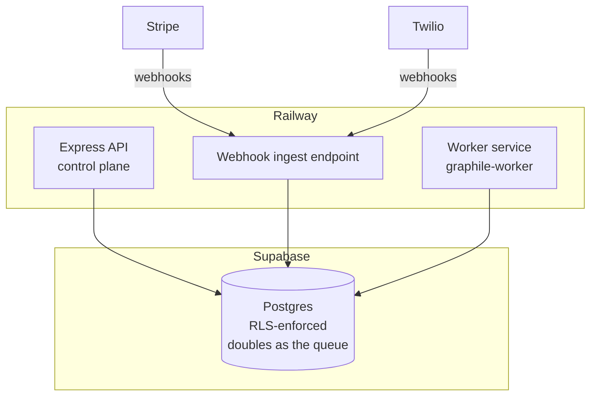
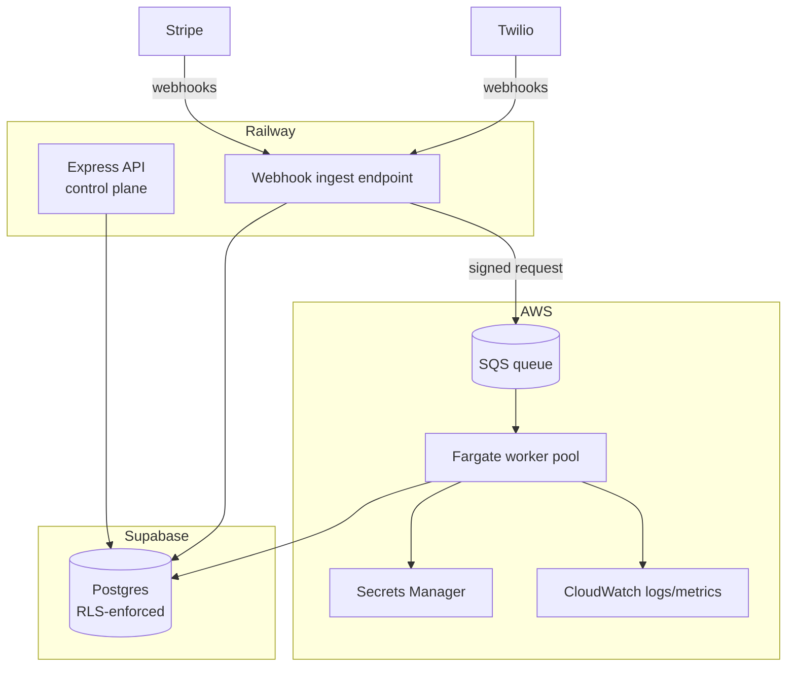
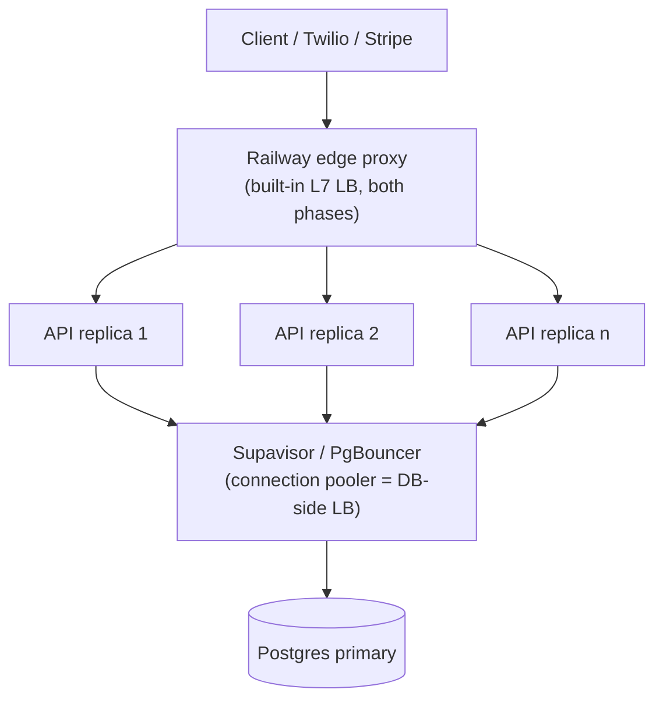

# Switchboard — Multi-Tenant Communications Backend

A backend architecture sketch + build-out for a multi-tenant SaaS platform handling per-workspace branding/domains/billing, high-throughput Twilio call/SMS events, and background job processing at 200+ workspace scale.

Written for the Hyper backend assessment (Backend Engineer role) — answers the five assessment questions inline, then continues as a working portfolio piece past the deadline.

## 0. Getting Started

This repo is a pnpm + Turborepo monorepo. `apps/api` and `apps/worker` are the two Railway-deployable services from §7 Phase 1; `packages/*` are shared code between them.

```bash
pnpm install
cp .env.example .env        # fill in Supabase/Twilio/Stripe values
pnpm generate               # prisma generate — required before typecheck/build
pnpm migrate                # prisma migrate deploy
pnpm dev                    # runs api + worker together, via turbo
```

Individual services:
```bash
pnpm --filter @switchboard/api dev
pnpm --filter @switchboard/worker dev
```

Type-check, build, and test the whole workspace:
```bash
pnpm typecheck
pnpm build
pnpm test
```

Deploying to Railway: each of `apps/api` and `apps/worker` has its own `railway.json` + `Dockerfile` — connect the repo, point two Railway services at these two subdirectories (Root Directory setting), and Railway builds each from its own Dockerfile independently.

---

## 1.0 Resource Model: Pooled Multitenant vs Silo Multitenant



One API fleet, one database, one queue, one worker pool — all tenants run through the same physical resources (**pool model**). Isolation is a logical guarantee (`tenant_id` + RLS), not a physical one (separate DBs/containers per tenant, the **silo model**).

Tenant users and cross-platform admins are two different actors on this diagram, not one. Tenant users flow through the normal API path — a JWT carrying their `tenant_id`, scoped automatically by RLS, no special-casing. Platform admins (internal support/ops staff) hit a **separate `/admin` route** rather than sharing the tenant-facing API surface, because their access pattern is fundamentally different: they need to reach *across* tenants, which the tenant path is deliberately built not to allow. See §5 for how that route stays narrow and audited rather than becoming a quiet bypass of the isolation guarantee below.

| | Pool (shared resources) | Silo (dedicated per tenant) |
|---|---|---|
| Cost at 200+ tenants | Low — resources shared, sized for aggregate load | High — idle capacity per tenant |
| Onboarding | Insert a tenant row, done | Provision new DB/compute per tenant |
| Noisy-neighbor risk | Real — one tenant's spike can affect others (mitigated by per-tenant rate limits + worker autoscaling) | None — hard resource boundary |
| Isolation strength | Logical (RLS), enforced in software | Physical, enforced by infrastructure |
| Ops burden | One thing to patch, monitor, upgrade | N things to patch, monitor, upgrade |

**Pick: pool model.** At 200+ workspaces, the silo model's per-tenant provisioning and ops overhead doesn't scale — the pool model does, as long as isolation is enforced by default rather than opt-in (see §3 for how RLS makes that concrete at the schema level).

**Phased build-out — same resource model, two implementations:**

| | Phase 1 (now) | Phase 2 (at scale) |
|---|---|---|
| Queue | Postgres-backed (`graphile-worker`, `LISTEN/NOTIFY`) | AWS SQS |
| Workers | Second Railway service, same repo, no HTTP server | AWS Fargate task |
| Trigger to move | None yet — this is the assessment/portfolio build | Sustained queue depth, event volume, or latency that Railway's worker service can't absorb by scaling replicas alone |

The pool-model diagram above and the isolation guarantees don't change between phases — only the physical implementation of "queue" and "worker" does. That swap is intentionally invisible to the rest of the system (see §4 for the interface that makes it a config change, not a rewrite).

---

## 2. Tech stack + rationale

| Layer | Choice | Why |
|---|---|---|
| Control plane API | Node.js / TypeScript / Express, hosted on **Railway** | Fast iteration, zero-ops deploys, matches the JD's stated stack |
| Database | **Supabase Postgres** | Managed Postgres with RLS; forkable per the JD's ask |
| ORM / data access | **Prisma** | One typed data-access layer shared by API and worker. Chosen over supabase-js deliberately: supabase-js talks HTTP to PostgREST and only works against Supabase, which conflicts with the JD's "Supabase **or** Neon, forkable" requirement. Prisma speaks Postgres directly and runs against either |
| Event durability | **Postgres-backed queue** (`graphile-worker`) now → **AWS SQS** later | No new infra to stand up a durable buffer today; swaps in behind a `Queue` interface when volume justifies AWS |
| Background workers | **Second Railway service** now → **AWS Fargate** later | Independently scalable replica count on Railway today; same shape as Fargate autoscaling, smaller knobs, no new cloud account required to start |
| Payments | **Stripe** (subscriptions) + **Plaid** (bank-linked payment methods) | Matches JD requirement directly |
| IaC | **Terraform**, split across Railway + Supabase + Stripe now, AWS added in Phase 2 | Versioned, reviewable infra; multi-cloud pieces added only when the AWS bridge is actually built |

**Why Railway *and* (eventually) AWS, not just one:** Railway is the fast-moving control plane (API, auth, dashboard, billing endpoints) — cheap to iterate on, good DX. AWS is where I'd move anything that needs to scale independently of request/response latency once Railway's own scaling headroom is exhausted: the event queue and worker fleet. Building the `Queue`/`Worker` interface now, backed by Postgres and a second Railway service, means that move is a swapped implementation later, not a rewrite — that's the scaling-risk answer baked into the architecture itself (see §6).

---

## 3. Data model + tenant isolation



Every tenant-owned table carries `tenant_id`. That column is the isolation boundary — every query, every RLS policy, every worker job is scoped by it.

`PLATFORM_ADMINS` and `AUDIT_LOG` are deliberately **not** tenant-owned tables — `platform_admins` has no `tenant_id` at all (an admin isn't scoped to a tenant, that's the point), and `audit_log` carries `tenant_id` only as a record of *which* tenant an action touched, not as a row-level access boundary. Keeping them structurally separate from the tenant tables is what stops "admin access" from quietly becoming a second, parallel isolation model — see §5 for how these tables are actually used.

### Isolation approach: shared schema + RLS, not schema-per-tenant

| | Shared schema + RLS | Schema-per-tenant |
|---|---|---|
| Migrations at 200+ tenants | One migration, applies everywhere | O(n) — 200+ schemas to migrate, drift risk |
| Connection pooling | Simple — one pool | Hard — pool-per-schema or session-level `SET search_path` juggling |
| Isolation guarantee | Enforced by Postgres RLS at the row level | Enforced by schema boundary (strong, but operationally expensive) |
| Onboarding a new tenant | Insert a row | Provision a new schema + run all migrations against it |
| Blast radius of a bug | A missing `tenant_id` filter *could* leak rows — mitigated by RLS being mandatory, not optional | A bug can't cross schemas as easily, but a bad migration script can wreck all of them at once |

**Pick: shared schema, `tenant_id` column, Postgres RLS enforced at the database layer** (not just app middleware). At 200+ tenants, schema-per-tenant's migration and connection-pooling overhead outweighs its isolation benefit — and RLS gives comparable isolation guarantees without the operational cost, as long as every table's policy is enforced by default (deny-by-default, not allow-by-default).

```sql
alter table call_events enable row level security;

create policy tenant_isolation on call_events
  using (tenant_id = current_setting('app.tenant_id')::uuid);
```

The app sets `app.tenant_id` per request/connection from the verified JWT claim — so even a bug in application code that forgets a `WHERE tenant_id = ...` clause still can't leak another tenant's rows, because Postgres enforces it underneath.

---

## 4. Webhook + event handling at scale



The ingest endpoint does the minimum possible work synchronously: verify the Twilio signature, persist the raw event, enqueue, return `200`. Twilio retries on non-2xx, so the endpoint must respond fast and idempotently — actual processing happens off the request path entirely. This decoupling is what lets call/SMS volume spike without the API tier falling over: the queue absorbs the burst, workers drain it at whatever rate they're scaled to.

Background jobs (non-webhook — billing retries, report generation, etc.) go through the same `jobs` table + queue pattern, tagged by `type`, so there's one worker fleet and one retry/backoff mechanism rather than two.

### Implementation today: Postgres queue, no AWS required

`webhook_events` and `jobs` already look like a queue — `graphile-worker` formalizes that with row-level locking (`SELECT ... FOR UPDATE SKIP LOCKED`), retries, backoff, and `LISTEN/NOTIFY` for near-instant pickup instead of polling. It runs as a second Railway service (`worker`), same repo, no HTTP server — scaled independently via Railway's replica count.

The producer/consumer code never talks to Postgres or SQS directly — it talks to an interface, so the Phase 2 swap is additive:

```ts
// src/queue/index.ts
export interface Queue {
  enqueue(type: string, payload: object, tenantId: string): Promise<void>;
}
export interface Worker {
  process(handler: (job: Job) => Promise<void>): void;
}

// src/queue/postgres.ts   — Phase 1, implements Queue/Worker via graphile-worker
// src/queue/sqs.ts        — Phase 2, implements Queue/Worker via AWS SDK, swapped in by config
```

---

## 5. Auth, roles, and billing



- **Auth**: JWT (Supabase Auth or custom), claims include `tenant_id`, `user_id`, `role`.
- **Roles**: `owner`, `admin`, `member` per tenant via `memberships.role` — a user can belong to multiple tenants with different roles in each.
- **Enforcement happens twice**: once in app middleware (role → action permission), once in Postgres (RLS on `tenant_id`). Neither is trusted alone.
- **Billing**: `subscriptions` row per tenant, linked to a Stripe subscription. Stripe webhooks (`invoice.paid`, `customer.subscription.updated`, etc.) land on the same ingest → queue → worker pipeline as Twilio events — billing state changes are just another event type, not a special case. Webhook handlers are idempotent, keyed on Stripe's event ID, since Stripe retries deliveries.
- **Plaid**: used for `payment_methods` where a tenant links a bank account directly rather than a card — same `payment_methods` table, `provider = 'plaid'`.

### Cross-platform admins: a separate, audited path — not an RLS bypass

Tenant users authenticate into exactly one tenant per request, by design. Internal staff (support, ops, billing reconciliation) need to look *across* tenants — a genuinely different access pattern that the tenant path is deliberately built not to serve.



- Platform admins carry a **different JWT** — a `platform_role` claim, no ambient `tenant_id` — and hit a separate `/admin` route, never the tenant-facing API surface.
- No admin gets a blanket cross-tenant connection or a `BYPASSRLS` grant. Every admin action **explicitly selects one tenant to act on** — impersonation, not bypass — which still sets `app.tenant_id` for that request, so RLS stays enforced identically for admins and tenant users. The only thing that differs is *who's allowed to pick which tenant*.
- Every impersonation action writes an `audit_log` row (`admin_id`, `tenant_id`, `action`, `context`, `timestamp`) — this is what actually answers "how would you know if an admin misused cross-tenant access," rather than trusting that they didn't.

---

## 6. Scaling risks + how the design addresses them

| Risk | Mitigation in this design |
|---|---|
| Webhook burst (viral tenant, mass SMS campaign) overwhelms the API | Ingest does no processing — write + enqueue only. The queue absorbs the burst; workers scale independently of request rate (Railway replica count today, Fargate task count in Phase 2) |
| A noisy tenant starves others of worker capacity | Per-tenant rate limiting at ingest (token bucket keyed on `tenant_id`); can move to per-tenant SQS message groups (FIFO) in Phase 2 if strict fairness is needed |
| RLS policy missing on a new table = silent data leak | `enable row level security` + explicit policy is part of the migration template — deny-by-default, CI check that fails a migration adding a table without RLS |
| Postgres queue becomes the bottleneck as event volume grows (Phase 1 ceiling) | This is the actual trigger for Phase 2, not a hypothetical — `graphile-worker` on a single Postgres instance has a real throughput ceiling; the `Queue` interface means the SQS swap doesn't touch ingest or worker business logic when that ceiling is hit |
| Railway ↔ AWS bridge is a new failure mode (once Phase 2 is built) | Ingest writes to Postgres *before* enqueuing — if the queue is unreachable, the event isn't lost, just picked up by a retry/backfill job scanning `webhook_events` where `status = 'pending'` |
| Stripe/Twilio webhook replay or out-of-order delivery | Idempotency keyed on the provider's event ID (`stripe_invoice_id`, `twilio_call_sid`) — duplicate delivery is a no-op, not a double-charge or double-write |
| Schema migrations at 200+ tenants | Shared-schema design (§3) means migrations run once, not per-tenant |
| RLS silently not enforced because the app connects as table owner or superuser | `ENABLE ROW LEVEL SECURITY` alone does **not** apply policies to a table's owner, and superusers bypass RLS unconditionally. Both are silent — queries just return everything. Mitigated with `FORCE ROW LEVEL SECURITY` on every table plus a dedicated `app_user` role created `NOSUPERUSER NOBYPASSRLS` (see `packages/db/prisma/migrations/0002_rls`) |
| Prisma prepared statements break against the transaction-mode pooler | Supavisor in transaction mode doesn't support prepared statements, which Prisma uses by default — surfaces as intermittent errors under concurrency, not at boot. `?pgbouncer=true` on `DATABASE_URL` disables them; `DIRECT_URL` bypasses the pooler for migrations |
| Per-query overhead from the RLS extension | Every Prisma call becomes a two-statement transaction (`set_config` + query). Correct, but not free — worth benchmarking under load before assuming it's negligible, and a reason to batch reads rather than issue many small ones per request |
| Unaudited cross-tenant access (support/ops staff need to see multiple tenants) | Platform admins never get a blanket RLS bypass — every cross-tenant action goes through `/admin`, requires a `platform_role` claim, explicitly selects one tenant (still RLS-scoped), and writes to `audit_log` (§5). The alternative — a quiet `BYPASSRLS` grant on a support role — is exactly the kind of gap that undermines the isolation guarantee this whole design rests on |

---

## 7. Deployment + infrastructure

### Phase 1 — Railway-only, no AWS account required



Three Railway services (API, ingest, worker — or ingest folded into API if traffic doesn't justify splitting it yet), one Supabase Postgres instance doing double duty as both the system of record and the queue. This is what actually gets built and deployed for the portfolio piece — real, running, no cloud account to provision first.

### Phase 2 — AWS bridge added when Postgres-queue throughput is the bottleneck



The Railway worker service is retired; the `Queue`/`Worker` interface (§4) is re-implemented against SQS/Fargate instead of Postgres. Ingest and API code don't change.

**⚠️ Flagged design choice — not a given:** Railway and AWS have no native private network peering. The ingest → SQS handoff is over public HTTPS using signed requests (HMAC or AWS IAM credentials scoped to the ingest service), not a VPC-level trust boundary. This is a legitimate, common pattern for cross-provider bridges, but it's a deliberate tradeoff worth stating out loud rather than glossing over.

**Terraform split:**
- `infra/railway/` — Railway project + service definitions, applies in both phases (via the community-maintained `terraform-community-providers/railway` provider — not an official Railway/HashiCorp provider, flagging that distinction explicitly since it affects long-term support risk)
- `infra/aws/` — SQS queue, Fargate task/service definitions, IAM roles, Secrets Manager entries, CloudWatch log groups — **Phase 2 only**, not provisioned until the queue-throughput trigger in §6 is actually hit
- `infra/supabase/` — Supabase project provisioning + platform settings only, via the official `supabase/supabase` provider. **Not** schema or RLS policies — those live in `packages/db/prisma/` and are applied with `prisma migrate`, outside Terraform's scope.
- `infra/stripe/` — product/price catalog + webhook endpoint config, via the official `stripe/stripe` provider (currently 0.x — early, pinned to an exact version rather than a range). **Not** runtime subscriptions — those are created by application code when a tenant signs up, not by Terraform.

### Load balancing, horizontal, and vertical scaling — where each actually sits



Two load balancers, not one — easy to only name the obvious one:
- **HTTP-level:** Railway's built-in edge proxy load-balances across replicas of a service automatically, in both phases, since API/ingest never leave Railway in this design. No nginx/HAProxy/ALB to stand up or manage.
- **DB-connection-level:** the moment API replicas scale horizontally, each one opens its own connection pool, and Postgres has a hard `max_connections` ceiling. Supabase's **Supavisor** (transaction-mode PgBouncer-compatible pooler) sits between app replicas and Postgres, multiplexing many app connections into few DB connections — load-bearing past a couple of replicas, not optional.
- An ALB/API Gateway only enters a hypothetical Phase 3, if the control plane itself ever moved off Railway onto AWS. Fargate workers in Phase 2 pull from SQS rather than receive inbound traffic, so they don't need a load balancer at all.

| Component | Horizontal | Vertical |
|---|---|---|
| API / ingest (Railway) | Increase replica count — Railway's proxy distributes automatically | Bump Railway service CPU/RAM tier |
| Worker — Phase 1 (Railway) | Increase replica count — safe because `SELECT ... FOR UPDATE SKIP LOCKED` lets replicas compete for jobs without double-processing | Bump CPU/RAM per replica |
| Worker — Phase 2 (Fargate) | ECS service auto-scaling, target-tracking on SQS queue depth | Task size (0.25 vCPU → 4 vCPU steps) |
| Queue | Phase 1: bounded by Postgres itself (the actual Phase 2 trigger, §6); Phase 2: SQS scales natively | N/A — managed service |
| Postgres | Read replicas only — reads fan out, writes cannot | Compute tier bump — the main lever, and the eventual ceiling |

**Honest ceiling:** everything above scales horizontally except Postgres writes. A single primary caps write throughput regardless of API/worker replica count. Vertical scaling + read replicas cover 200 pooled tenants comfortably; if write throughput ever became the actual bottleneck, the real answer is sharding (e.g. Citus) or splitting hot tables out — a Phase 3 conversation, not something this design claims to solve today.

**Docker and Kubernetes:**
- **Docker — introduced now, not deferred.** Every service (API, worker) ships a `Dockerfile` from day one, even while running on Railway (Railway deploys from a Dockerfile directly). This is what makes the Phase 2 move to Fargate a config change instead of a migration — Fargate requires a container image in ECR, so having one already avoids redoing build tooling later.
- **Kubernetes — not justified at this scale**, and worth saying so rather than defaulting to it. Fargate gives the horizontal-scaling and isolation benefits of container orchestration without running a cluster control plane. Raw Kubernetes only earns its complexity for things Fargate doesn't provide — custom scheduling, a service mesh, multi-region active-active — none of which apply at 200 pooled tenants.

---

## 8. Repo structure

```
/
├── README.md                  ← this file
├── docs/
│   ├── scaling-risks.md       (expanded version of §6)
│   └── decisions/              (ADRs for isolation approach, bridge design, etc.)
├── infra/
│   ├── railway/                (railway_project, railway_service, env vars)
│   ├── aws/                    (sqs.tf, fargate.tf, iam.tf, secrets.tf, cloudwatch.tf)
│   ├── supabase/                (supabase_project, supabase_settings)
│   └── stripe/                  (stripe_product, stripe_webhook_endpoint)
├── src/
│   ├── api/                    (Express: routes, controllers, middleware)
│   ├── ingest/                  (Twilio + Stripe webhook receivers)
│   ├── workers/                  (SQS consumers, job processors)
│   ├── db/                       (Supabase client, RLS policy definitions, query helpers)
│   ├── auth/                      (JWT verify, RBAC middleware)
│   ├── billing/                    (Stripe + Plaid integration)
│   └── shared/                      (tenant context, types, config)
├── tests/
└── package.json
```

**Drop-guide:** `docs/` and this README are what's submitted for the assessment — no code required to answer the five questions. `infra/`, `apps/`, and `packages/` are the build-out that continues after the Wednesday deadline, toward a deployed, working instance ahead of the Thursday interview.

---

## 9. Assumptions & unverified anchors (flagged explicitly)

- Railway↔AWS bridge uses signed public HTTPS requests, not VPC peering — a design choice, confirmed above, not something to assume works "for free."
- Railway Terraform provider is community-maintained (`terraform-community-providers/railway`), not published by Railway or HashiCorp.
- Stripe's official Terraform provider (`stripe/stripe`) is at v0.2.2 — pre-1.0, resource coverage may be incomplete; pin exact versions.
- Supabase's official Terraform provider manages project/org-level settings only, not table schema or RLS policies.
- Region choice (`af-south-1` in the ERD example) is illustrative — actual region should be picked based on where Twilio/Stripe latency and Supabase region availability line up.
- Phase 1 (Postgres queue + Railway worker service) is what's actually deployed for this portfolio piece. Phase 2 (SQS + Fargate) is a designed-for target, not yet provisioned — stated as such rather than implied to be running.
